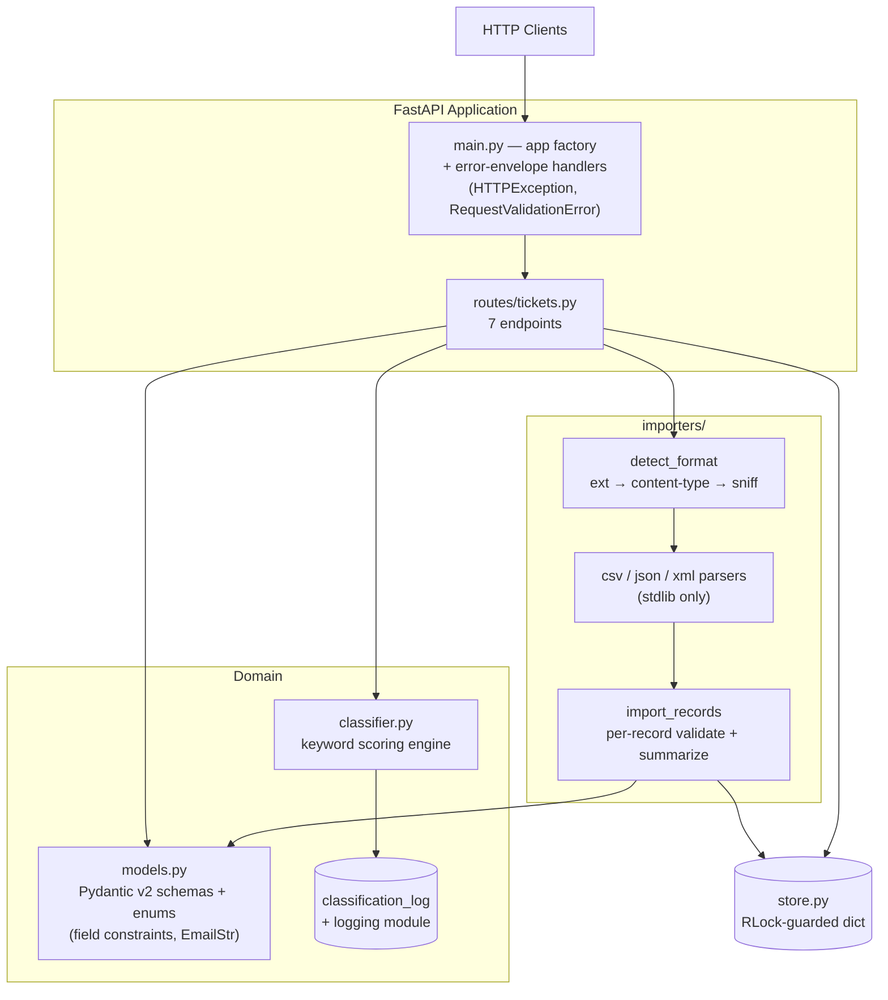
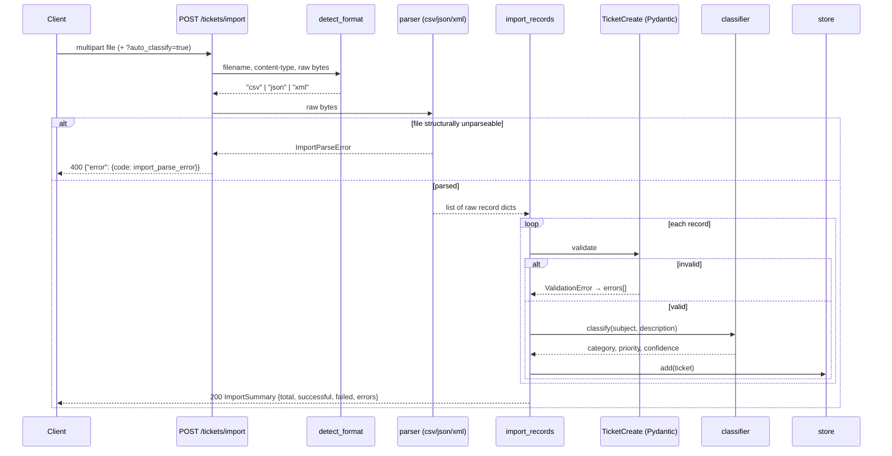
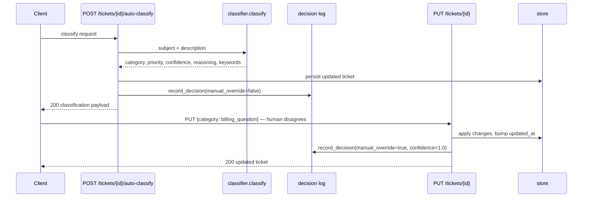

<!-- Generated with Claude Fable 5 as part of the multi-model documentation workflow (see PLAN.md §6) -->

# Architecture

Audience: technical leads. Covers component design, data flow, design decisions and trade-offs, and security/performance considerations for the Intelligent Customer Support System.

## High-Level Architecture

### Components

| Component | Responsibility |
|---|---|
| `main.py` | Creates the FastAPI app, mounts the ticket router, and installs two exception handlers that reshape *every* error (framework 404s, Pydantic validation failures, route-raised `HTTPException`s) into one envelope: `{"error": {"code", "message", "details"}}`. |
| `models.py` | Single source of truth for the domain: 5 enums (`Category`, `Priority`, `Status`, `Source`, `DeviceType`), `TicketCreate` / `TicketUpdate` / `Ticket` schemas with constraints (subject 1–200 chars, description 10–2000 chars, `EmailStr`), plus `ClassificationResult` and `ImportSummary`. Validation lives entirely in the schema layer — routes never hand-validate. |
| `store.py` | Thread-safe in-memory repository. All reads/writes go through an `RLock`; `list_tickets` applies category/priority/status/assignee/tag/free-text filters plus limit/offset pagination inside the lock. |
| `classifier.py` | Pure scoring function + side-effecting `record_decision`. Keyword tables per category/priority; word-boundary regex matching; subject hits weighted 2×. Confidence = winner's share of the total score (0.3 baseline for `other`). Every decision — automatic or manual override — is appended to `classification_log` and emitted via `logging`. |
| `importers/` | `detect_format` (extension → content-type → byte sniffing), one stdlib parser per format, and `import_records`, which validates each record independently through `TicketCreate` and never lets one bad row abort the batch. |

## Data Flow

### Bulk import with auto-classification

### Classification and override lifecycle

## Design Decisions & Trade-offs

| Decision | Alternative | Why this way |
|---|---|---|
| **In-memory store with `RLock`** | SQLite/Postgres + ORM | Zero setup, deterministic tests, and the concurrency test (20+ parallel requests) exercises real lock behavior. Trade-off: no persistence across restarts — acceptable for the assignment, and the store's narrow interface (`add/get/update/delete/list_tickets`) makes swapping in a database a one-module change. |
| **Rule-based classifier, not an LLM** | Claude/OpenAI API call | Deterministic and offline: identical input → identical output, so tests are exact assertions rather than mocks. No API keys, latency, or cost. Trade-off: no semantic understanding — misspellings or paraphrases miss. The `ClassificationResult` shape (confidence + reasoning) was designed so an LLM backend could be dropped in without changing the API contract. |
| **`bug_report` keys on reproduction-step language, not "bug"** | Include "bug" in both tables | "bug"/"crash" would collide with `technical_issue`, making category selection order-dependent. TASKS.md defines `bug_report` as "defects **with reproduction steps**", so it keys on "steps to reproduce", "defect", "regression", etc., keeping all six categories separable. |
| **Per-record import validation** | All-or-nothing transactional import | Support data is messy; rejecting a 50-row file over one bad email helps nobody. Each row validates independently and the summary pinpoints every failure with a reason. Trade-off: partial imports aren't atomic — the summary is the client's tool for reconciliation. |
| **Validation lives in Pydantic schemas only** | Route-level checks | One source of truth used identically by the single-create endpoint and all three import paths — a field constraint added to `TicketCreate` is instantly enforced everywhere. |
| **Uniform error envelope via app-level exception handlers** | Per-route error shaping | Clients parse one shape (`error.code/message/details`) whether the failure is a framework 404, a Pydantic 422, or a domain 400. |
| **Format detection with sniffing fallback** | Trust the file extension | Real uploads are mislabeled; extension → content-type → leading-byte sniff (`{`/`[` → JSON, `<` → XML, else CSV) means a correct file with a wrong name still imports. |
| **`resolved_at` semantics** | Clear on any non-resolved status | Set when entering `resolved`; *kept* on `resolved → closed` (closing is not reopening); cleared only when moving back to an active status. Preserves resolution history for a normally closed ticket. |

## Security Considerations

- **Input validation everywhere** — all writes pass through Pydantic schemas (email format, length bounds, enum whitelists); unknown/invalid values are rejected with 422 before touching state.
- **XML parsing** uses stdlib `xml.etree.ElementTree`, which does not resolve external entities by default (mitigates XXE). No DTD processing is performed.
- **No injection surface** — no SQL, no shell-outs, no template rendering of user input; user text is only stored and returned as JSON.
- **UUID path parameters** are type-enforced by FastAPI (`UUID`), so malformed IDs are rejected as 422 rather than reaching the store.
- **Known gaps (out of scope, would matter in production):** no authentication/authorization, no rate limiting, no upload size cap on `/tickets/import`, in-memory decision log is unbounded. Each is noted here deliberately rather than half-implemented.

## Performance Considerations

- **Lock granularity** — a single `RLock` serializes store access. Fine at this scale (list of 1,000 tickets filters in well under 500 ms; asserted by tests); a real deployment would move filtering to a database.
- **Classifier cost** — pure regex scans over subject+description, O(keywords × text length), measured under 10 ms per ticket in `test_performance.py`; classification of a 50-record import stays comfortably inside the 2 s benchmark.
- **Import path** — files are read fully into memory (`await file.read()`), acceptable for assignment-scale files; a streaming parser would be the production upgrade.
- **Measured benchmarks** (asserted in `tests/test_performance.py`): single create < 50 ms, 50-record CSV import < 2 s, list of 1,000 < 500 ms, single classification < 10 ms, 100 sequential requests within throughput bounds.
