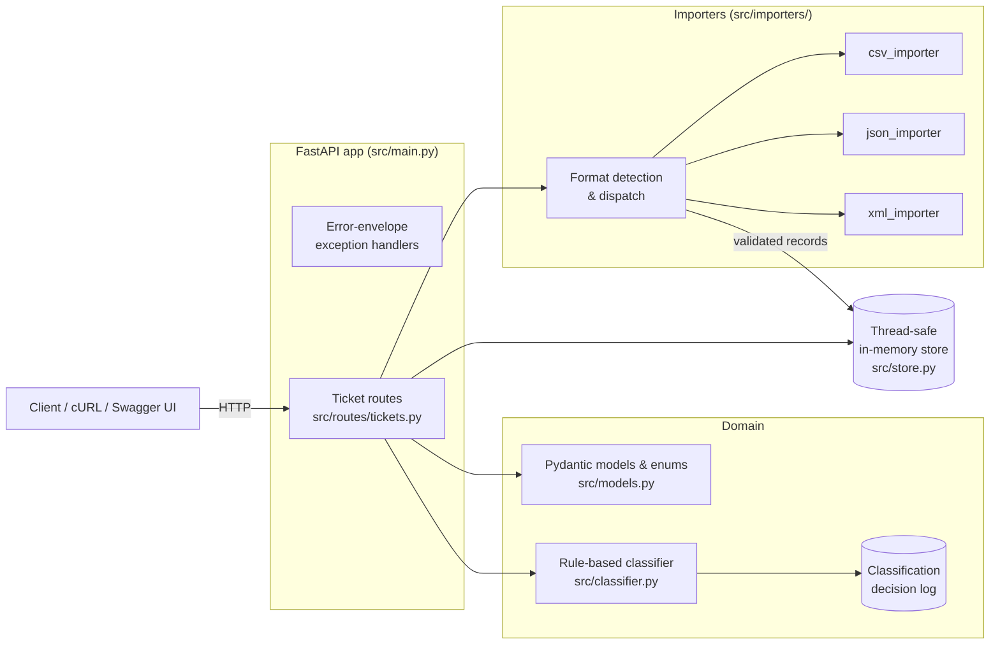

<!-- Generated with Claude Fable 5 as part of the multi-model documentation workflow (see PLAN.md §6) -->

# 🎧 Homework 2: Intelligent Customer Support System

> **Student Name**: Maksym Chykalo
> **Date Submitted**: 2026-07-16
> **AI Tools Used**: Claude Code — **Claude Fable 5** (planning, architecture, README/ARCHITECTURE docs, review) + **Claude Sonnet 5** (implementation, tests, API_REFERENCE/TESTING_GUIDE/HOWTORUN docs). See [PLAN.md](PLAN.md) for the full model-attribution table.

---

## Project Overview

A customer support ticket management REST API built with **FastAPI**. It provides:

- **Full ticket CRUD** — create, list (with rich filtering), get, update, delete.
- **Bulk import from CSV, JSON, and XML** — one endpoint accepts any of the three formats (detected by extension, content-type, or content sniffing), validates every record independently, and returns a per-record success/failure summary. A bad row never aborts the rest of the file.
- **Rule-based auto-classification** — deterministic keyword scoring assigns one of six categories and one of four priorities, returning a confidence score (0–1), human-readable reasoning, and the matched keywords. It can run on demand (`POST /tickets/{id}/auto-classify`), automatically on creation or import (`?auto_classify=true`), and manual overrides via `PUT` are logged alongside automatic decisions.
- **Consistent error envelope** — every handled error returns `{"error": {"code", "message", "details"}}` with an appropriate HTTP status code (201, 204, 400, 404, 422).

Storage is a thread-safe in-memory store (an `RLock`-guarded dict), which keeps the system dependency-free and the test suite deterministic.

## Architecture



## Installation & Setup

Requires Python 3.9+.

```bash
cd homework-2
python3 -m venv .venv
.venv/bin/pip install -r requirements.txt
```

Start the server:

```bash
.venv/bin/uvicorn src.main:app --reload
```

The API is now at `http://localhost:8000` — interactive docs at `http://localhost:8000/docs`. See [HOWTORUN.md](HOWTORUN.md) for a step-by-step walkthrough and [API_REFERENCE.md](API_REFERENCE.md) for endpoint details with cURL examples.

## Running the Tests

```bash
cd homework-2
.venv/bin/python -m pytest tests/ --cov=src --cov-report=term --cov-report=html --cov-fail-under=85
```

Current results: **70 tests, all passing, 96.99% coverage** (HTML report in `htmlcov/`). Test-suite structure, fixture data, benchmarks, and a manual QA checklist are documented in [TESTING_GUIDE.md](TESTING_GUIDE.md).

## Project Structure

```
homework-2/
├── PLAN.md                  # Implementation plan + AI model attribution (Fable 5)
├── README.md                # This file (Fable 5)
├── ARCHITECTURE.md          # Design deep-dive for tech leads (Fable 5)
├── API_REFERENCE.md         # Endpoint reference for API consumers (Sonnet 5)
├── TESTING_GUIDE.md         # QA guide (Sonnet 5)
├── HOWTORUN.md              # Setup & run guide (Sonnet 5)
├── requirements.txt
├── src/
│   ├── main.py              # App factory, error-envelope exception handlers
│   ├── models.py            # Ticket schemas, enums, validation constraints
│   ├── store.py             # Thread-safe in-memory store
│   ├── classifier.py        # Keyword-scoring classifier + decision log
│   ├── importers/           # CSV/JSON/XML parsers + format detection/dispatch
│   └── routes/tickets.py    # All /tickets endpoints
├── tests/                   # 8 test files, 70 tests + fixtures/ sample data
├── demo/                    # Demo script
└── docs/screenshots/        # Coverage report screenshot, AI-interaction evidence
```

## How AI Was Used

The work followed the **Context–Model–Prompt** framework with an explicit two-model split:

1. **Context** — the AI was given `TASKS.md`, the repo's `CLAUDE.md` conventions, and homework-1's code style as reference.
2. **Model** — **Fable 5** handled planning and architecture (producing `PLAN.md` before any code was written) and authored the developer/tech-lead docs; **Claude Sonnet 5** executed the plan (all source code, all 70 tests, sample-data generation) and authored the consumer/QA docs.
3. **Prompt** — Sonnet received the plan as its authoritative spec plus explicit acceptance criteria (per-file test minimums, >85% coverage gate); it reported back deviations with justifications, which were reviewed and accepted.

All test results and coverage numbers were verified manually by re-running the suite.

---

<div align="center">

*This project was completed as part of the AI-Assisted Development course.*

</div>
