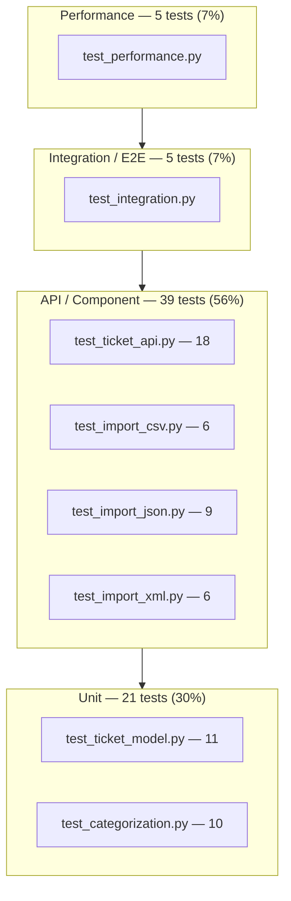

<!-- Generated with Claude Sonnet 5 as part of the multi-model documentation workflow (see PLAN.md §6) -->

# Testing Guide — Intelligent Customer Support System

Audience: **QA engineers** validating this service, manually or by running the automated suite.

The suite has **70 tests** across 8 files, all passing, with **96.99% statement coverage** on `src/`.

## Test pyramid

Counts below are taken directly from the test files (one `def test_*` per case).



| Layer | Files | Tests | % of suite |
|---|---|---:|---:|
| Unit | `test_ticket_model.py`, `test_categorization.py` | 21 | 30% |
| API / component | `test_ticket_api.py`, `test_import_csv.py`, `test_import_json.py`, `test_import_xml.py` | 39 | 56% |
| Integration / E2E | `test_integration.py` | 5 | 7% |
| Performance | `test_performance.py` | 5 | 7% |
| **Total** | 8 files | **70** | 100% |

- **Unit** — pure-Python checks with no HTTP layer: Pydantic validation rules (`TicketCreate`/`TicketMetadata`) and the classifier's `classify()` function called directly.
- **API / component** — `fastapi.testclient.TestClient` calls against a real endpoint (one behavior per test): status codes, response shapes, filters, and the three format-specific importers (CSV/JSON/XML happy path, partial failures, malformed input).
- **Integration / E2E** — multi-step workflows spanning several endpoints: full ticket lifecycle, bulk import + classification verification, 25 concurrent creates via threads, combined filters, override-after-auto-classify persistence and logging.
- **Performance** — wall-clock smoke tests with generous thresholds to catch gross regressions without flaking CI.

## How to run

All commands assume you are in the `homework-2/` directory with the virtual environment active.

### Setup (once)

```bash
python3 -m venv .venv
source .venv/bin/activate        # Windows: .venv\Scripts\activate
pip install -r requirements.txt
```

### Full suite

```bash
source .venv/bin/activate
pytest
```

### A single file

```bash
source .venv/bin/activate
pytest tests/test_categorization.py -v
```

### A single test

```bash
source .venv/bin/activate
pytest tests/test_ticket_api.py::test_create_ticket_success -v
```

### With coverage (terminal + HTML report)

```bash
source .venv/bin/activate
pytest --cov=src --cov-report=term-missing --cov-report=html --cov-fail-under=85
```

The HTML report is written to `htmlcov/index.html`; open it in a browser to see line-by-line coverage per module. `--cov-fail-under=85` makes the run fail if coverage drops below 85% (actual is ~97%, so there is headroom).

Expected terminal summary:

```
70 passed in ~2s

---------- coverage: platform darwin, python 3.9.x -----------
Name                             Stmts   Miss  Cover
--------------------------------------------------------------
src/classifier.py                   71      0   100%
src/models.py                      106      0   100%
src/routes/tickets.py                89      0   100%
src/store.py                         48      0   100%
...
--------------------------------------------------------------
TOTAL                              531     16    97%
```

## Fixture data

All fixtures live in `tests/fixtures/`.

| File | Records | Purpose |
|---|---:|---|
| `sample_tickets.csv` | 50 | Happy-path CSV import — all valid rows, mix of categories/priorities via realistic subject/description text. |
| `sample_tickets.json` | 20 | Happy-path JSON import — top-level array, nested `metadata`, array `tags`. |
| `sample_tickets.xml` | 30 | Happy-path XML import — `<tickets>`/`<ticket>` structure with nested `<tags>` and `<metadata>`. |
| `invalid_tickets.csv` | 7 (3 valid / 4 invalid) | Partial-failure CSV import: bad email, too-short description, missing subject, bad `category` enum value. |
| `invalid_tickets.json` | 8 (3 valid / 5 invalid) | Partial-failure JSON import: bad email, too-short description, missing `customer_id`, bad enum, wrong type (`tags` as a string instead of array). |
| `invalid_tickets.xml` | 6 (2 valid / 4 invalid) | Partial-failure XML import: bad email, too-short description, missing `customer_id` element, bad enum value. |
| `malformed.csv` | — | Unparseable file: invalid UTF-8 byte sequence → `400 import_parse_error`. |
| `malformed.json` | — | Unparseable file: truncated/invalid JSON syntax → `400 import_parse_error`. |
| `malformed.xml` | — | Unparseable file: unclosed XML tag → `400 import_parse_error`. |

## Manual testing checklist

Run these against a live server (`uvicorn src.main:app --reload`, default `http://localhost:8000`) to sanity-check behavior a QA engineer would care about beyond the automated suite.

1. **Liveness** — `curl http://localhost:8000/` returns `200` with `"name": "Intelligent Customer Support System"`.
2. **Swagger UI loads** — open `http://localhost:8000/docs` in a browser; all 7 endpoints are listed under the `tickets` tag.
3. **Create a valid ticket** — `POST /tickets` with a complete body returns `201`, a UUID `id`, and defaults `status=new`, `priority=medium`, `category=other`.
4. **Reject invalid email** — `POST /tickets` with `customer_email: "not-an-email"` returns `422` with `error.code == "validation_error"` and a `details` entry naming the `customer_email` field.
5. **Reject short description** — `POST /tickets` with a `description` under 10 characters returns `422`.
6. **Auto-classify on create** — `POST /tickets?auto_classify=true` with subject/description containing "cannot log in" / "password" returns `category: "account_access"` and a non-null `classification` object.
7. **Get by id** — `GET /tickets/{id}` for a ticket just created returns `200` with matching `id`.
8. **Get missing id** — `GET /tickets/{random-uuid}` returns `404` with `error.code == "ticket_not_found"`.
9. **Get malformed id** — `GET /tickets/not-a-uuid` returns `422` (path validation, not a 404).
10. **List + filter** — create two tickets with different `category` values, then confirm `GET /tickets?category=billing_question` returns only the matching one.
11. **List + free-text search** — confirm `GET /tickets?q=refund` matches on substrings in either `subject` or `description`, case-insensitively.
12. **Pagination** — create 5+ tickets, confirm `GET /tickets?limit=2&offset=1` returns exactly 2 results, and that ordering is stable (by `created_at`).
13. **Update + status side effects** — `PUT /tickets/{id}` with `{"status": "resolved"}` sets `resolved_at`; a follow-up `PUT` with `{"status": "in_progress"}` clears `resolved_at` back to `null`.
14. **Manual override** — `PUT /tickets/{id}` with `{"category": "technical_issue", "priority": "high"}` after an auto-classify updates `classification.reasoning` to mention "Manual override" and persists across a subsequent `GET`.
15. **Delete** — `DELETE /tickets/{id}` returns `204` with an empty body; a follow-up `GET` on the same id returns `404`.
16. **Bulk import (CSV)** — upload `tests/fixtures/sample_tickets.csv` via multipart form to `POST /tickets/import`; confirm `{"total_records": 50, "successful": 50, "failed": 0, "errors": []}` and `GET /tickets` now lists 50 tickets.
17. **Bulk import with partial failures** — upload `tests/fixtures/invalid_tickets.csv`; confirm `failed: 4` and that each entry under `errors` has both a `record` (dict) and a human-readable `reason` (string).
18. **Malformed file rejected** — upload `tests/fixtures/malformed.csv`, `.json`, and `.xml` in turn; confirm each returns `400` with `error.code == "import_parse_error"`.

## Performance benchmarks

Asserted in `tests/test_performance.py`. Thresholds are intentionally generous relative to the informal targets in `TASKS.md`, to avoid CI flakiness on loaded or sandboxed runners — they catch gross regressions (e.g. an accidental O(n²) scan), not tight benchmarks.

| Test | Scenario | Asserted threshold | Informal target (TASKS.md) |
|---|---|---:|---:|
| `test_single_create_under_threshold` | `POST /tickets` single create | < 500 ms | 50 ms |
| `test_csv_import_50_records_under_threshold` | `POST /tickets/import` with 50-row CSV | < 5 s | 2 s |
| `test_list_1000_tickets_under_threshold` | `GET /tickets?limit=1000` after creating 1000 tickets | < 2 s | 500 ms |
| `test_classification_under_threshold` | `classify()` called directly (no HTTP) | < 50 ms | 10 ms |
| `test_100_sequential_requests_throughput` | 100 sequential `POST /tickets` round-trips | < 10 s | — (throughput smoke test) |
