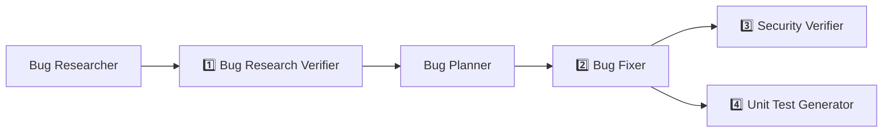

# Homework 4 — Multi-Agent Bug-Fixing Pipeline

**Author:** Maksym Chykalo

A **4-agent pipeline** (plus two supporting agents) that takes raw bug reports and, in one
command, produces verified research, an implementation plan, applied fixes, a security
review, and generated FIRST-compliant unit tests — all run against a real sample
application in this folder.

## The pipeline



**Run order:** Bug Researcher → Bug Research Verifier → Bug Planner → Bug Fixer →
Security Verifier (changed code) → Unit Test Generator (changed code). The last two stages
are independent of each other and can run in parallel.

**Single command:**

```bash
npm run pipeline      # == ./run-pipeline.sh
```

The script starts every agent in the correct order via headless Claude Code (`claude -p`),
loads each agent's definition as its system prompt, selects the **model from the agent's
frontmatter**, checks that each stage produced its artifact before starting the next, and
enforces the quality gate (pipeline stops if research verification FAILs).

## Agents and model selection

Each agent declares its model in its `*.agent.md` frontmatter. Choices are cost-tiered by
where reasoning actually matters:

| Agent | File | Model | Why this model |
|-------|------|-------|----------------|
| Bug Researcher | `agents/bug-researcher.agent.md` | `claude-sonnet-5` | Read-only root-cause hunting on a small codebase — solid reasoning at mid cost. |
| **Bug Research Verifier** ⭐ | `agents/research-verifier.agent.md` | `claude-opus-5` | Adversarial fact-checking; a wrong PASS poisons every later stage, so the strongest reasoning model sits at the gate. |
| Bug Planner | `agents/bug-planner.agent.md` | `claude-sonnet-5` | Transforms already-verified findings into concrete edits — no open-ended verification left. |
| **Bug Fixer** ⭐ | `agents/bug-fixer.agent.md` | `claude-haiku-4-5` | Purely mechanical: the plan contains verbatim before/after blocks, so the fast/cheap model executes and runs tests. |
| **Security Verifier** ⭐ | `agents/security-verifier.agent.md` | `claude-opus-5` | Security review is adversarial reasoning; missed findings are expensive. |
| **Unit Test Generator** ⭐ | `agents/unit-test-generator.agent.md` | `claude-sonnet-5` | Edge-case thinking bounded by the diff — right capability/cost balance for test authoring. |

⭐ = the four required agents.

This tiering paid off in the real run: the Opus verifier found a defect the Sonnet
researcher missed (see below), while Haiku applied all three fixes flawlessly because the
plan left it zero decisions to make.

## Skills

| Skill | Used by | Purpose |
|-------|---------|---------|
| [`skills/research-quality-measurement.md`](skills/research-quality-measurement.md) | Research Verifier | Defines the GOLD/SILVER/BRONZE/UNRELIABLE/REJECTED scale, how to measure each dimension, the ≥ BRONZE gate rule, and the exact required format of `verified-research.md`. |
| [`skills/unit-tests-FIRST.md`](skills/unit-tests-FIRST.md) | Unit Test Generator | Defines **F**ast / **I**ndependent / **R**epeatable / **S**elf-validating / **T**imely concretely for this repo (node:test, zero deps) and the required FIRST Compliance table in `test-report.md`. |

## Sample application (Task 5)

**Tiny Expense Tracker** — a zero-dependency Node.js HTTP API (`src/`): add expenses, list
by category, monthly summary, admin reset. Runs with `npm start`, tested with `npm test`
(built-in `node:test` runner).

Seeded defects (documented as symptom-only reports in
[`context/bugs/001/bug-context.md`](context/bugs/001/bug-context.md)):

1. **Bug:** `calculateTotal` loop started at index 1 → first expense silently dropped
   (`src/utils.js`).
2. **Bug:** `filterByMonth` compared 0-indexed `getMonth()` against the 1-indexed query
   month → March queries returned April, December returned nothing (`src/utils.js`).
3. **Security issue:** hardcoded admin token `'admin123'` compared with loose,
   non-constant-time `==` guarding the destructive `POST /admin/reset` (`src/auth.js`).

Before the pipeline: `npm test` → **3 pass / 4 fail**
([`docs/test-results-before.txt`](docs/test-results-before.txt)).
After the pipeline: full suite green, including the agent-generated regression tests
([`docs/test-results-after.txt`](docs/test-results-after.txt)).

## Real pipeline run — artifacts

All artifacts under [`context/bugs/001/`](context/bugs/001/) were produced by the agents in
an actual run (each stage on its declared model tier):

| Stage | Artifact | Result |
|-------|----------|--------|
| Bug Researcher | [`research/codebase-research.md`](context/bugs/001/research/codebase-research.md) | 3 root causes located with file:line evidence |
| Research Verifier | [`research/verified-research.md`](context/bugs/001/research/verified-research.md) | **PASS — SILVER (4/5)**; all 14 references resolved, snippets byte-exact; found a genuine researcher omission: `filterByMonth` used **local-time** getters on UTC ISO dates — a second, independent wrong-month cause |
| Bug Planner | [`implementation-plan.md`](context/bugs/001/implementation-plan.md) | 3 changes with verbatim before/after + per-change test command; folded the verifier's finding into the month fix |
| Bug Fixer | [`fix-summary.md`](context/bugs/001/fix-summary.md) | **SUCCESS** — all changes applied, suite 3 pass/4 fail → **7/7** |
| Security Verifier | [`security-report.md`](context/bugs/001/security-report.md) | Confirms the seeded issue resolved; residual findings rated by severity |
| Unit Test Generator | [`test-report.md`](context/bugs/001/test-report.md) | Generated regression + edge-case tests (`tests/*.generated.test.js`), FIRST compliance recorded, full suite green |

The most interesting multi-agent moment: the **verifier improved the fix** — its
"Discrepancy 3" (local-timezone `getFullYear()`/`getMonth()` on UTC timestamps) survived
into the plan as an explicit requirement to use `getUTCFullYear()`/`getUTCMonth()`,
so the shipped fix is more correct than the original research alone would have produced.

## How to run

See [`HOWTORUN.md`](HOWTORUN.md). Quick version:

```bash
cd homework-4
npm test                     # run the suite (7 baseline + generated tests)
npm start                    # run the app on http://localhost:3000
npm run pipeline             # re-run the full agent pipeline (needs claude CLI)
```

## Project structure

```
homework-4/
├── README.md / HOWTORUN.md
├── run-pipeline.sh              # single-command pipeline runner
├── package.json                 # start / test / pipeline scripts
├── agents/                      # 6 agent definitions (*.agent.md, model in frontmatter)
├── skills/                      # research-quality-measurement, unit-tests-FIRST
├── context/bugs/001/            # bug context + all pipeline artifacts
│   └── research/                # codebase-research.md, verified-research.md
├── src/                         # Tiny Expense Tracker (fixed state)
├── tests/                       # baseline + agent-generated tests
└── docs/                        # before/after test logs, screenshots/
```

## Screenshots

All in [`docs/screenshots/`](docs/screenshots/):

| # | File | Shows |
|---|------|-------|
| 1 | `01-tests-before-fix.png` | `npm test` before the pipeline — seeded bugs, 3 pass / 4 fail |
| 2 | `02-pipeline-run.png` | Full pipeline run, stage by stage with per-agent models |
| 3 | `03-security-scan.png` | Security Verifier findings table + verdict |
| 4 | `04-tests-after-fix.png` | `npm test` after the pipeline — 20/20 incl. generated tests |
| 5 | `05-app-demo.png` | Fixed app exercised live via curl (correct totals, old token denied) |
| 6 | `06-research-verification.png` | Verified research: quality graded SILVER per the skill |

Underlying raw logs are kept next to them in `docs/` (`test-results-before.txt`,
`test-results-after.txt`, `app-demo.txt`, `pipeline-run.log`) and can be re-rendered with
`docs/make-screenshot.sh`.

## AI tools used

- **Claude Code (Claude Fable 5)** orchestrated the whole assignment: scaffolded the app
  with seeded defects, authored the agent/skill definitions and the runner script, then
  executed the pipeline by spawning each agent as a subagent **on its declared model tier**
  (Sonnet → Opus → Sonnet → Haiku → Opus ∥ Sonnet).
- Every pipeline artifact in `context/bugs/001/` is genuine agent output, not hand-written.
- Manually verified: test results before/after, the applied diffs, and that the security
  fix denies access when `ADMIN_TOKEN` is unset.
